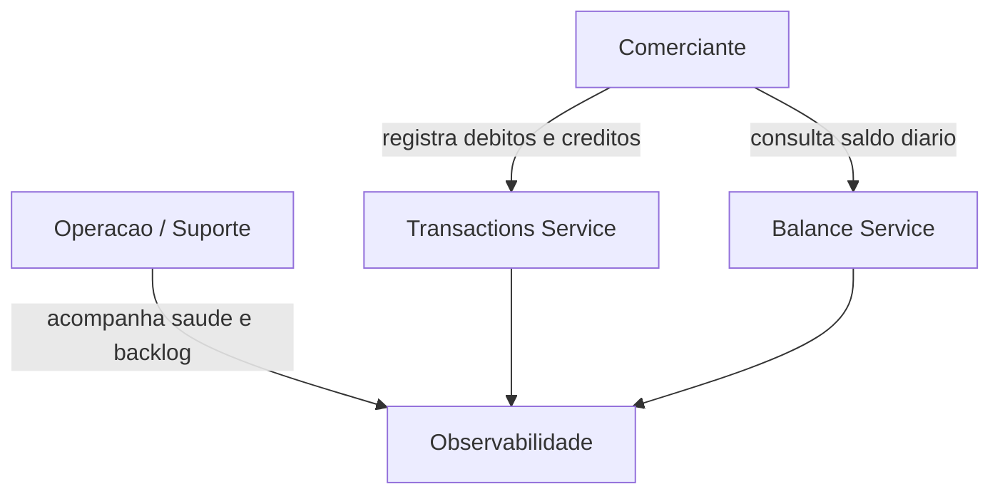
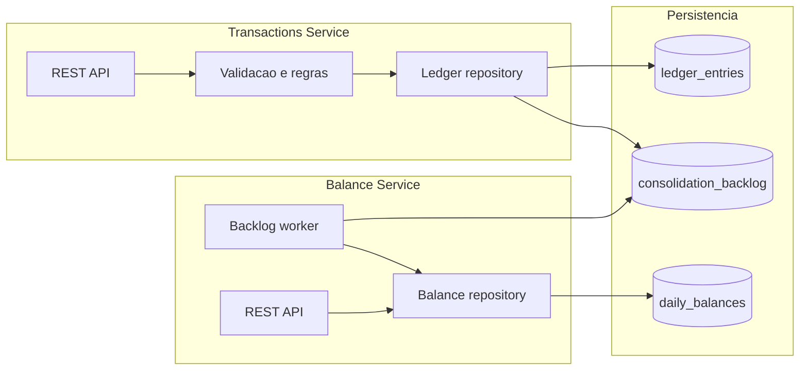
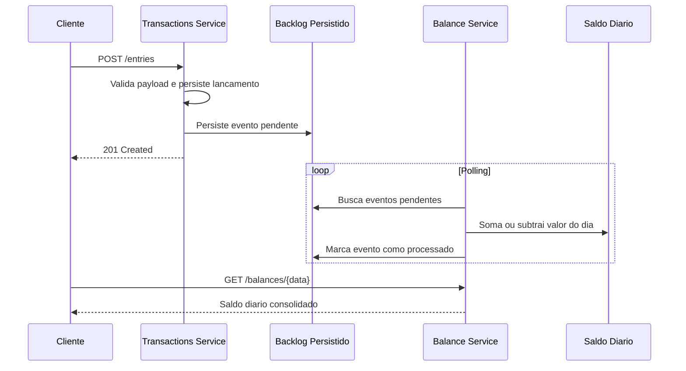
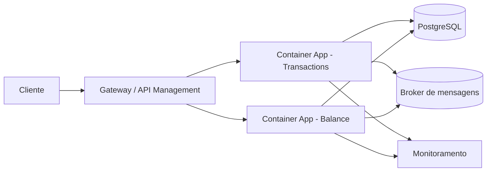

# Arquitetura alvo

## Dominios funcionais e capacidades de negocio

| Dominio funcional | Capacidade de negocio | Responsabilidade |
| --- | --- | --- |
| Gestao de Caixa | Registrar lancamentos | Receber debitos e creditos do comerciante com rastreabilidade |
| Gestao de Caixa | Consultar extrato diario | Expor historico de lancamentos por dia |
| Consolidacao Financeira | Consolidar saldo diario | Transformar eventos de lancamento em saldo por data |
| Operacao da Plataforma | Monitorar saude e fila | Medir backlog, disponibilidade e comportamento operacional |
| Seguranca e Governanca | Proteger APIs | Validar entrada, reduzir perda de dados e preparar evolucao de autenticacao |

## Desenho de contexto



## Arquitetura proposta

```mermaid
flowchart LR
    Merchant[Comerciante / Cliente] -->|POST /entries| TS[Transactions Service]
    Merchant -->|GET /balances/{data}| BS[Balance Service]
    TS -->|grava lancamento| DB[(SQLite / ledger_entries)]
    TS -->|persiste backlog| BL[(SQLite / consolidation_backlog)]
    BS -->|consome backlog| BL
    BS -->|atualiza saldo diario| BAL[(SQLite / daily_balances)]
    TS -->|health| OPS[Monitoramento]
    BS -->|health| OPS
```

## Desenho de componentes



## Fluxo de consolidacao



## Justificativa de arquitetura e tecnologias

### Estilo arquitetural

- **Escolha para a prova de conceito**: servicos independentes dentro de um monorepo.
- **Motivacao**: manter separacao clara de responsabilidade sem elevar demais a complexidade operacional local.
- **Trade-off**: um monorepo simplifica onboarding, testes e demonstracao, mas a arquitetura alvo documentada admite evolucao para deploy separado por servico.

### Linguagem e framework

- **Python + FastAPI**
  - produtividade alta para prova tecnica
  - validacao forte com Pydantic
  - documentacao OpenAPI nativa
  - boa ergonomia para APIs e testes

### Persistencia

- **SQLite na prova de conceito**
  - setup local imediato
  - sem dependencia externa para avaliacao
  - suficiente para demonstrar regras de negocio, backlog e resiliencia
- **Evolucao recomendada**
  - PostgreSQL para dados transacionais
  - broker de eventos para desacoplamento do consolidado

## Como a solucao atende os requisitos nao funcionais

| Requisito | Mecanismo adotado |
| --- | --- |
| Lancamentos nao podem parar se o consolidado cair | O Transactions Service apenas grava lancamento e backlog persistido, sem depender de chamada sincrona ao Balance Service |
| 50 requisicoes por segundo no consolidado | Endpoint de leitura simples, acesso por chave de data e script de carga com 50 requisicoes concorrentes |
| Ate 5% de perda | Persistencia local, processamento idempotente por backlog e demonstracao por script de carga |
| Disponibilidade | Separacao entre APIs e health endpoints independentes |
| Resiliencia | Recuperacao por backlog persistido quando o consolidado volta |
| Observabilidade | Health endpoints e backlog exposto para monitoramento |

## Fronteiras de contexto

- **Transactions Service**
  - dono do cadastro de lancamentos
  - aceita entradas do dominio financeiro operacional
- **Balance Service**
  - dono da visao consolidada
  - materializa leitura otimizada por dia

## Desenho de deploy recomendado



## Riscos conhecidos e mitigacoes

| Risco | Mitigacao |
| --- | --- |
| Acoplamento por banco local na POC | Evoluir para banco por servico e mensageria dedicada |
| Crescimento de volume historico | Particionamento/log compaction na evolucao com PostgreSQL e broker |
| Reprocessamento concorrente | Lock local no Balance Service e backlog com status processado |
