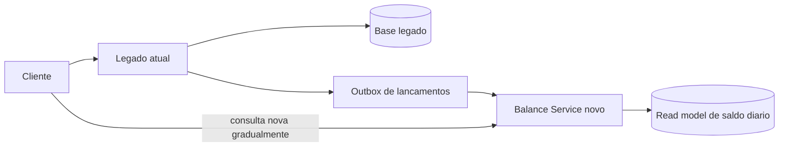

# Arquitetura de transicao

## Quando ela se aplica

Se existir um legado monolitico que hoje faz tanto os lancamentos quanto o consolidado, a evolucao recomendada e incremental para reduzir risco operacional.

## Desenho de transicao

## Etapas

1. manter o legado como ponto unico de entrada
2. introduzir outbox de lancamentos no legado
3. publicar os eventos para o novo fluxo de consolidacao
4. disponibilizar o `Balance Service` para leitura paralela
5. migrar clientes consumidores do consolidado para o novo endpoint
6. por ultimo, extrair ou substituir a escrita do legado pelo `Transactions Service`

## Ganhos da transicao

- menor risco de big bang
- possibilidade de comparar saldos entre legado e nova solucao
- rollback mais simples
- evolucao progressiva para mensageria e banco dedicados
